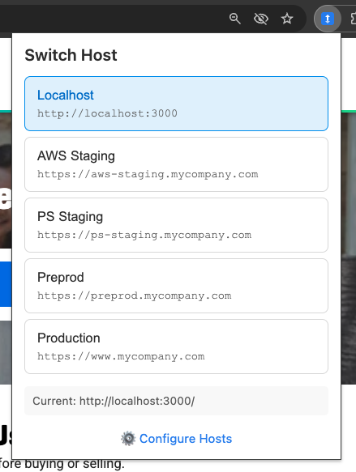
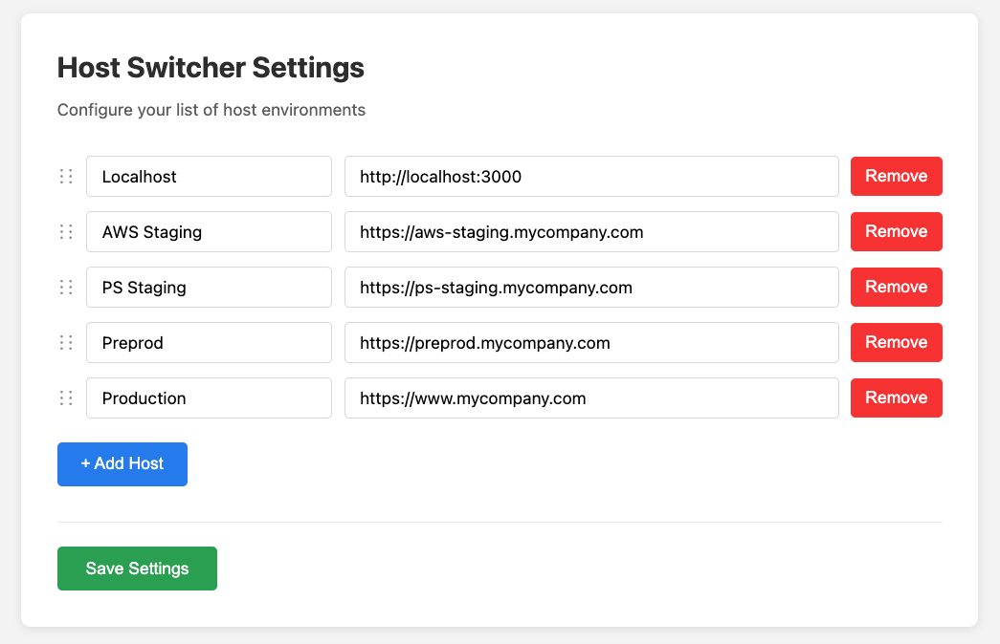

# host-switcher-chrome-extension

A Chrome extension that allows you to quickly switch between different host environments (like localhost, staging, and production) while preserving the current page path. Vibe coded; prompts are in commit messages.

## Screenshots

## Features

- ✅ Configurable host list - Add, edit, or remove hosts
- ✅ Settings page - Right-click extension icon → "Options" or click "⚙️ Configure Hosts" in popup
- ✅ Persistent storage - Settings sync across Chrome browsers when signed in
- ✅ Validation - Ensures URLs are valid before saving
- ✅ User-friendly interface - Clean design with drag handles for future reordering

## To Install

1. Click this link to download the ZIP file: [`host-switcher-chrome-extension-1.0.0.zip`]( https://github.com/saltycrane/host-switcher-chrome-extension/archive/refs/tags/v1.0.0.zip) 
2. After downloading, unzip the file
3. Open Chrome and go to chrome://extensions/
4. Enable "Developer mode" (toggle in top right)
5. Click "Load unpacked"
6. Select the unzipped folder (e.g. `host-switcher-chrome-extension-1.0.0`)

(Alternatively you can clone the repo instead of downloading the ZIP file.)

## To Use

1. Navigate to any page on one of your hosts
2. Click the extension icon in your toolbar
3. Click any host button to switch to that environment while keeping the same path

## To Access Settings

- Method 1: Right-click the extension icon → "Options"
- Method 2: Click "⚙️ Configure Hosts" link at bottom of popup
- Method 3: Go to chrome://extensions/, find Host Switcher, click "Details" → "Extension options"
